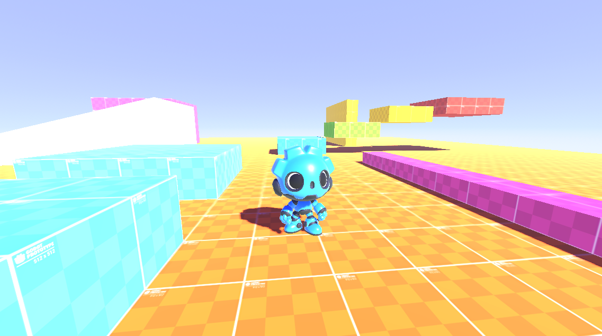

# Basic 3D Platformer Controller in Godot

A clean third-person 3D platformer movement system built for **Godot 4**

---

# **General**

This asset provides a basic, beginner-friendly `CharacterBody3D` third-person platformer controller.

It is complete with a graybox playground (stairs, gaps, a ramp, a beam, and a wall) so you can test movement, jumping, and the camera immediately.

The controller is designed with `@export` to make it easy for beginners to adjust, change, and personalize the system without direct code.

This asset is 100% hand-written in clean GDScript with comments for explanations and derivations.

# Compatibility

- **Godot 4.0 - 4.7**: Fully supported out of the box

---

# **Features**

**Player Character**
- Simple 3D velocity-based movement using `CharacterBody3D`
- Camera-relative walk (W moves where the camera is looking, not where the skin is looking)
- Customizable move speed, acceleration, skin turn-speed, and jump using `@export` variables
- Gravity pulled from project settings, easy to change
- Jump when grounded

**Camera**
- Orbit camera on a `SpringArm3D`
- Mouse look with pitch clamp
- Cursor capture (click to hide, Esc to show)

**World and Environment**
- 3D graybox playground built with `CSG` nodes
- Stairs, gaps, ramp, narrow beam, and a wall for camera and player collision
- Sky, sun, and fog

**Character**
- GDQuest Gobot skin (see credits) with idle, walk, run, jump, and fall

**Developer Experience**
- Inspector category grouping (`@export_group`)
- Self-contained addon with no extra libraries besides Gobot and prototype textures

---

# Installation / Quickstart

## Step 1: Download or Clone

Download or clone this repository and open the project inside Godot.

## Step 2: Input Actions

This controller uses **custom input actions** that are set in the `Input Map`.

If they are missing (the player controller does not work), go to **Project -> Project Settings -> Input Map** and add:

| Input Action Name | Purpose | Key |
| --- | --- | --- |
| `move_left` | Strafe left | A |
| `move_right` | Strafe right | D |
| `move_forward` | Move forward | W |
| `move_backward` | Move backward | S |
| `jump` | Jump | Spacebar |

## Step 3: Adding Player to Your Own Scene

1. Instance `res://addons/basic_3d_platformer/scenes/player.tscn` into your own 3D world scene.
2. Ensure your world has collision (`CSG` with **Use Collision** enabled, or `StaticBody3D`).
3. Select the player and tweak values in the **Inspector**:
   - **Camera**:
     - `Mouse Sensitivity`: How fast the orbit camera turns
   - **Movement**:
     - `Move Speed`: How fast the player walks
     - `Acceleration`: How quickly speed changes
     - `Rotation Speed`: How quickly the Gobot skin turns to face the move direction
     - `Jump Velocity`: Vertical jump power
4. Press **F5** to run your project.

# **Project Structure**

- `res://`
  - `addons/`
    - `basic_3d_platformer/`
      - `assets/`
        - `icon.png`
        - `preview1.png`
        - `preview2.png`
        - `preview3.png`
        - `godot prototypes/`
        - `godot-4-3d-character-gobot-main/`
          - `LICENSE`
          - `gdquest_gobot/`
      - `scenes/`
        - `player.tscn`
        - `main.tscn`
        - `map.tscn`
      - `scripts/`
        - `player.gd`
      - `LICENSE.txt`
      - `README.md`
      - `plugin.cfg`
      - `plugin.gd`
  - `LICENSE.txt`
  - `README.md`
  - `project.godot`

# **Requests & Contributing**

- **Bug Reports**: Open an issue in the [Issues](https://github.com/ar-bh/basic-3d-platformer-godot/issues) section.
- **Feature Requests**: Share ideas in the [Discussions](https://github.com/ar-bh/basic-3d-platformer-godot/discussions) section.

# **License**

**This addon** (player controller, scenes, playground, and documentation) is available under the [MIT License](https://opensource.org/license/MIT). Free to use in personal, non-commercial, and commercial projects.

**Gobot** is dual-licensed by GDQuest. Keep their `LICENSE` file next to the character:

- Gobot **source** (scripts, scenes): [MIT](https://www.gdquest.com/library/taxonomy/license/mit/)
- Gobot **art** (3D model and textures): [CC BY-NC-SA 4.0](https://creativecommons.org/licenses/by-nc-sa/4.0/deed.en) — **not** for commercial use

**Prototype textures** by PiCode are [MIT](https://github.com/PiCode9560/Godot-Prototype-Texture).

# **Credits**

- Made by Arjun Bhumula
- Prototype textures by PiCode, available on the [Godot Asset Library](https://godotengine.org/asset-library/asset/2480)

Attribution-NonCommercial-ShareAlike 4.0 International (CC BY-NC-SA 4.0).

This asset, "Gobot" by GDQuest (https://gdquest.com)
is licensed under CC BY-NC-SA 4.0 (https://creativecommons.org/licenses/by-nc-sa/4.0/deed.en).
The asset can be found at https://github.com/gdquest-demos/godot-4-3d-character-gobot.
